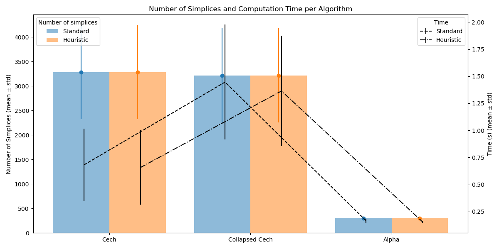

Matteo Allione
allionematteo@gmail.com
TSDS

# Betti Number Estimation from Point Clouds via Čech and Alpha Complexes

## Overview

Given a point cloud sampled from a (uniform density) on a smooth manifold, one can recover topological invariants of the underlying space — most notably the **Betti numbers**, which count connected components, holes, and voids of different dimensions, also in the presence of noise (see for example Nyogi, Smale, and Weinberger [1]).

This repository implements a pipeline to estimate Betti numbers by constructing complexes which are expected to be homotopically equivalent to the underlying manifold.

## Key Features

- Construction of **Čech complexes** using a *fast smallest enclosing ball* algorithm, following the method described in [2].
- Homology computed via **spectral methods** on Laplacian matrices [3,4].
- **Elementary collapse** [5] operations integrated during Čech complex construction to significantly reduce the size of the complex, improving time and memory performance.
- Optimized data structures: dictionary-of-sets representation enables constant-time lookup and efficient collapse operations.
- An alternative algorithm using **boundary matrix reduction** (akin to Gaussian elimination over ℤ), offering a different memory-time tradeoff. This is a generalization of the elementary collapse and operates directly on the boundary matrices [5].
- Support for **Alpha complexes** [6] — constructed as the intersection of the Čech complex and the Delaunay triangulation — drastically reduces the number of simplices, accelerating downstream computations.

## Performance Notes

- The Laplacian diagonalization was found to be a bottleneck due to its dense nature, this led to the idea of writing a function working directly with the boundary matrices.
- Collapse operations were added during Čech construction to reduce both memory usage and computational cost.
- Profiling showed that a **dictionary of sets** gave optimal performance for collapse detection and updates.
- The boundary matrix reduction approach was slower overall than the use of Laplacian matrix, though more memory-efficient, and was optimized using various sparse matrix formats (DOK, CSR, CSC).
- An heuristic method that should reduce the number of complexes is built, performances on a dataset of 100 random points on a 2d dimensional square are presented.

## References

    [1] Nyogi, P., Smale, S., & Weinberger, S. (2008). Finding the homology of submanifolds with high confidence from random samples. Discrete & Computational Geometry, 39(1–3), 419–441.

    [2] Fischer, K., Gärtner, B., Kutz, M. (2003). Fast Smallest-Enclosing-Ball Computation in High Dimensions. In: Di Battista, G., Zwick, U. (eds) Algorithms - ESA 2003. ESA 2003. Lecture Notes in Computer Science, vol 2832. Springer, Berlin, Heidelberg. https://doi.org/10.1007/978-3-540-39658-1_57

    [3] Gustavson, R. (2011). Some New Results on the Combinatorial Laplacian.

    [4] Goldberg, T.E. (2002). Combinatorial Laplacians of Simplicial Complexes.

    [5] Kaczynski, T., Mischaikow, K., & Mrozek, M. (2004). Computational homology. In Applied mathematical sciences. https://doi.org/10.1007/b97315

    [6] Otter, N., Porter, M.A., Tillmann, U. et al. A roadmap for the computation of persistent homology. EPJ Data Sci. 6, 17 (2017). https://doi.org/10.1140/epjds/s13688-017-0109-5